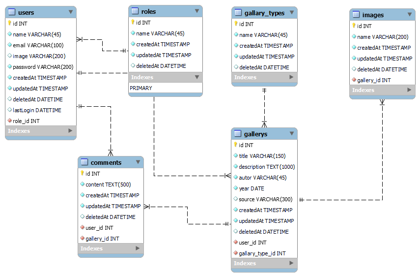

# Gallery app

## Description

galleyApp is a project created with the idea of practicing and learning new technologies, the center of
idea is a web platform in which publish gallery images from recognized authors and amateurs.

## Members

    - Ezequiel Rango
    - Juan De Giorgi

## Technologies

    - NodeJs
    - express
    - EJS
    - MySQL
    - Sequelize 

## Documentation

### example data base

   

## Envinroment setup

1) Create database
2) Copy .env.example to .env and fill with database credentials.

To install dependencies, run
``` bash
npm install
```

3) Migrations:
``` bash
npx sequelize-cli db:migrate
```

4) Seeders:
``` bash
npx sequelize-cli db:seed:all
```

## Start local server

``` bash
npm start
```